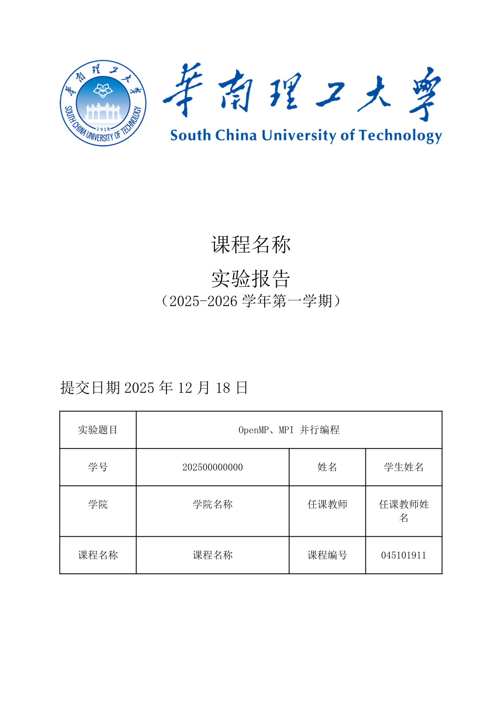
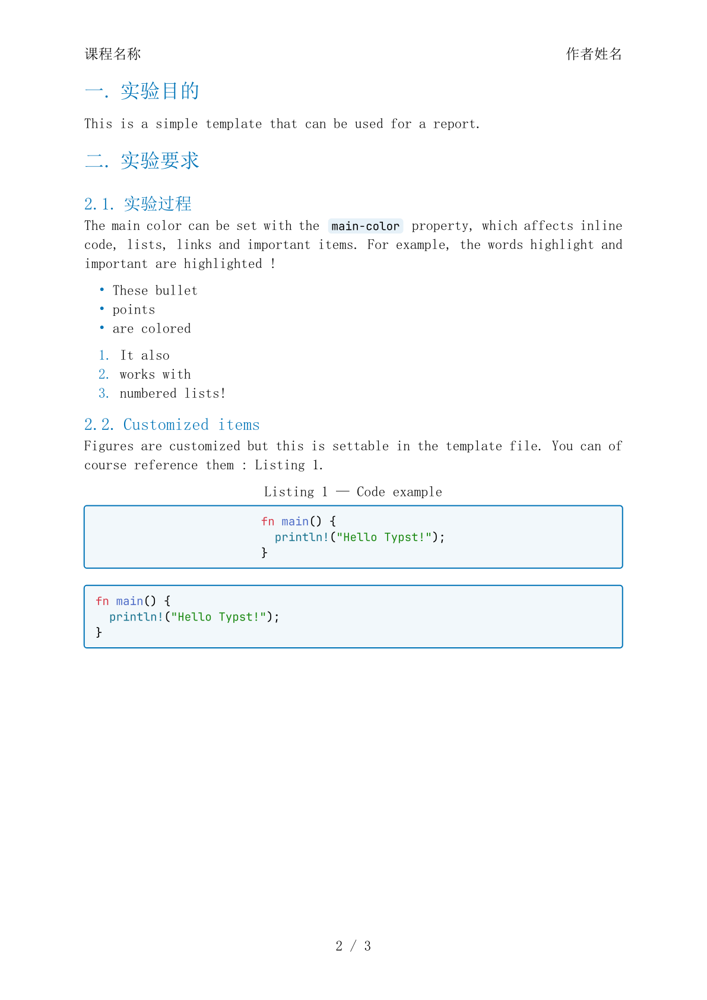

# Scut experiment Report template

Scut云计算实验报告的 Typst 模板，基于 [hzkonor/bubble-template](https://github.com/hzkonor/bubble-template) 修改开发。

## 特点

- 华工蓝与华工Logo，搭配上原 Bubble 的简洁彩色风格
- 支持自定义主色、作者、标题、日期、Logo 、以及课程信息等
- 页眉自动显示标题与作者，页脚自动显示页码

适用于SCUT实验报告等场景。

## 预览

| 封面                          | 使用例                      |
| ----------------------------- | --------------------------- |
|  |  |

可见仓库中的 `template/report.typ` 示例。

## License

MIT-0 License, consistent with [hzkonor/bubble-template](https://github.com/hzkonor/bubble-template).
